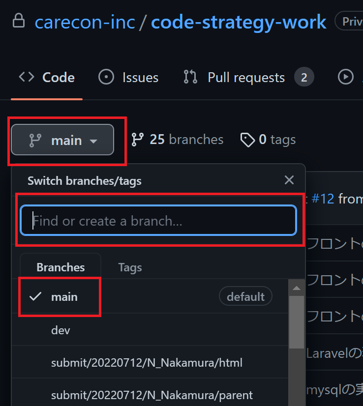
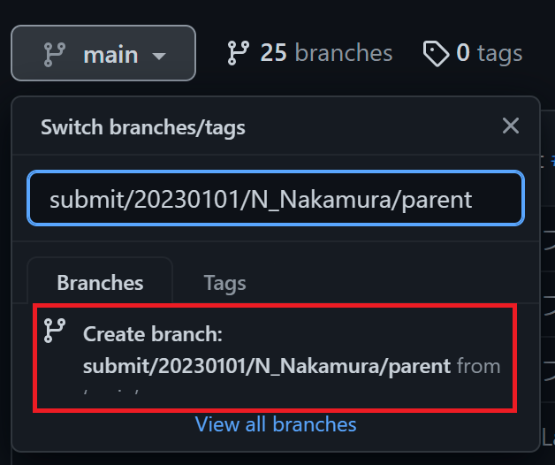

# カリキュラム生の方ははじめにここを読んでください！

## 目次  
[カリキュラムについて](#カリキュラムについて)  

[Code Strategyについて](#code-strategyについて)  

[Workについて](#workについて)  

[カリキュラムの進め方](#カリキュラムの進め方)

[Workの提出](#workの提出)

## 下準備

はじめに、プログラムを書くときに使うエディタをインストールしましょう。  
このカリキュラムでは[Visual Studio Code](https://code.visualstudio.com/)を推奨しています。

## カリキュラムについて

皆さんには知識を習得するためのCode Strategyと、コーディングスキルを確認するためのWorkの2軸でカリキュラムを進めていただきます。  
Code Strategyで習得した知識をもとに、Workに取り組んでいただくという流れですね。  
それぞれの概要を以下に記しますのでご確認ください！

### Code Strategyについて

---

カリキュラム導入のときに簡単に説明したと思いますが、Code Strategyについての概要を書いていきます。  
まだCode Strategyに登録していないという方は、講師に連絡お願いします！
リンクは[こちら](https://study.code-strategy.app/login/)です。

#### 概要  

Code Strategyは、**未経験から6ヶ月でエンジニアデビュー**を目標にしています。  
そのため、教材には**実装ができる最低限の知識**しか記載していません。  
周辺知識は自己学習やエンジニアデビューしてから業務の中で習得していくことになると思うので、まずは最低限の知識をつけていきましょう！  

Code Strategyは技術領域ごとに単元が分かれているので、順番に進めていきましょう。  
各コンテンツにはテキストベースの解説と、ものによってはサンプルコードの記載や、hands-onという実装の小課題もあります。  
サンプルコードやhands-onは実際に取り組んでいただいて、不明点があれば講師に質問しましょう！  
hands-onは提出の必要はありませんが、できてから進むようにしてください。  

また、コンテンツは随時改修してより良いものにしていきたいと思っているので、  
疑問点やわかりづらいことがあれば気兼ねなく講師に伝えてください！

### Workについて

---

Workは、Code Strategyで学習したことをベースに、見本通りの実装ができることを確認するためのものです。  
このリポジトリに、Workを進めるためのファイルやフォルダがあるので、cloneしてWorkに取り組んでください。  
また、Code Strategyの知識だけではWorkの実装をできないように作ってあるので、わからないことは調べたり講師に質問するなどして進めましょう！  

Workについての質問や提出はこのリポジトリ上にプルリクエストを作って提出していただきます。  
詳細は[Workの提出](#workの提出)にまとめています。  

Workは、お客様から依頼をいただいた想定で取り組んで提出してください。  
誤字脱字や実装漏れが無いか、指示通りの実装ができているかなどの確認もエンジニアの仕事のうちです。  

[こちら](https://work.code-strategy.app/)を見本に実装してください。

### カリキュラムの進め方

---

当カリキュラムではHTML,CSS,JavaScript,PHP,MySQL,Laravelの計6つのworkを用意しています。  
カリキュラムはCodeStrategyで学習しながら、workを順に実装していく流れで進めてください。  
例えばCodeStrategyでHTMLの単元を学習し終えたら、CodeStrategyでCSSの単元に進むのではなくHTMLのworkを実装して提出してください。  
講師が提出されたworkをレビューします。  
講師から承認されたらCodeStrategyでCSSの単元を学習し、workのCSSを実装して提出する、という流れで進めてください。

### Workの提出  

---
workの実装が完了すると提出をしていただきますが、それにあたってGitHub上で`main`ブランチから個人のブランチを切る(作成する)という作業をみなさんにやっていただきたいので、以下で解説します。  

#### ブランチとは
ブランチとはゲームで言うところのセーブデータのようなものだと今は思っておいてください。  
ブランチを切ることで、人のデータと自分のデータを区別します。    

#### ブランチの切り方

1. 下記画像の一番上の四角で囲ってある「main」と書かれたボタンを押してください。  
ブランチの一覧が表示されます。  
上から3つ目の四角で囲ってある「✓ main」ですが、「✓」は現在選択しているブランチで、「main」はブランチ名です。

2. 上から2つ目の四角で囲ってあるところに、次のフォーマットで文字を入力してください。  
```submit/カリキュラム開始年月日/名イニシャル_姓/parent```  
例)  
```submit/20220712/N_Nakamura/parent```  


3. 2の作業をすると、次の画像のようになります。  
`Create Branch`と書いてあるところを押すと新しくブランチが作成されます。  
このとき、現在選択しているブランチが親ブランチとなります。

4. Workの提出は、親ブランチから単元ごとに以下フォーマットで作成したブランチで作業して提出してください。  
```submit/カリキュラム開始年月日/名イニシャル_姓/Workの単元```  
例)  
```submit/20220712/N_Nakamura/html```  
```submit/20220712/N_Nakamura/css```

#### 提出のフロー

1. ローカルでの作業をリモートにpushする。
2. GitHub上でPull Requestのタブを選択し、「New pull request」のボタンを押してプルリクエストの作成を開始する。
3. 向き先は、実装したブランチから親ブランチとする。
4. 実装の内容を確認して問題なければ「Create pull request」のボタンを押してプルリクエストの作成を完了する。
