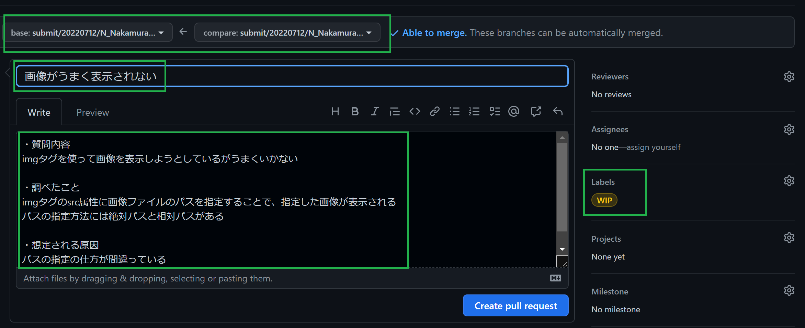

# カリキュラム生の方ははじめにここを読んでください！

## 目次  
[カリキュラムについて](#カリキュラムについて)  

[Code Strategyについて](#code-strategyについて)  

[Workについて](#workについて)  

[講師の意図](#講師の意図)  

[Workについて質問および提出](#workについて質問および提出)

## 下準備

はじめに、プログラムを書くときに使うエディタをインストールしましょう。  
このカリキュラムでは[Visual Studio Code](https://code.visualstudio.com/)を推奨しています。

## カリキュラムについて

皆さんには知識を習得するためのCode Strategyと、コーディングスキルを確認するためのWorkの2軸でカリキュラムを進めていただきます。  
それぞれの概要を以下に記しますのでご確認ください！

### Code Strategyについて

---

カリキュラム導入のときに簡単に説明したと思いますが、Code Strategyについての概要を書いていきます。  
まだCode Strategyに登録していないという方は、講師に連絡お願いします！

#### 概要  

Code Strategyは、**未経験から6ヶ月でエンジニアデビュー**を目標にしています。  
そのため、教材には**実装ができる最低限の知識**しか記載していません。  
周辺知識は自己学習やエンジニアデビューしてから業務の中で習得していくことになると思うので、まずは最低限の知識をつけていきましょう！  

Code Strategyは技術領域ごとに単元が分かれているので、順番に進めていきましょう。  
各コンテンツにはテキストベースの解説と、ものによってはサンプルコードの記載や、hands-onという実装の小課題もあります。  
サンプルコードやhands-onは実際に取り組んでいただいて、不明点があれば講師に質問しましょう！  
hands-onは提出の必要はありませんが、できてから進むようにしてください。  

また、コンテンツは随時改修してより良いものにしていきたいと思っているので、  
疑問点やわかりづらいことがあれば気兼ねなく講師に伝えてください！

### Workについて

---

Workは、Code Strategyで学習したことをベースに、見本通りの実装ができることを確認するためのものです。  
このリポジトリに、Workを進めるためのファイルやフォルダがあるので、cloneしてWorkに取り組んでください。  
また、Code Strategyの知識だけではWorkの実装をできないように作ってあるので、わからないことは調べたり講師に質問するなどして進めましょう！  

Workについての質問や提出はこのリポジトリ上にプルリクエストを作って提出していただきます。  
詳細は[Workについて質問および提出](#workについて質問および提出)にまとめています。  

Workは、お客様から依頼をいただいた想定で取り組んで提出してください。  
誤字脱字や実装漏れが無いか、指示通りの実装ができているかなどの確認もエンジニアの仕事のうちです。  

### 講師の意図  

---

さて、みなさんにはカリキュラムという仕組みで学習には取り組んでいただきますが、  
「カリキュラムを完了する = エンジニアになれる」ではないということを認識していただきたいです。  
どういうことかというと、言ってしまえばCode StrategyとWorkは、まったく理解していなくても人の力を借りればこなせてしまいます。  
そんな状態でカリキュラムを完了しても、みなさんはエンジニアではなく、ただカリキュラムをこなしただけの人です。  
一番はご自身のため、カリキュラムには真摯に取り組んでいただけると幸いです。  

ではこのカリキュラムを通して、皆さんに何を求めるかというと  
**最低限のコーディングスキル**に加え、**課題解決能力**と**コミュニケーション能力**と**自己管理能力**を身に着けることです。  
それぞれについて、以下に概要を記します。  
一般的に言われている言葉とは意味が違うと思いますが、講師が求めるのはこういうことなんだと認識していただけると助かります。  

- 課題解決能力  
  - 現状把握力：何ができていて、何ができないのかを自分で把握し認識する能力 
  - 検索力：求める情報を検索して探し出す能力
  - 言語化力：現状を把握したうえで、人にも伝わるように言語化する能力  

- コミュニケーション能力
  - 質問力：自分が聞きたいことを、相手に正しく簡潔に質問する能力
  - 巻き込み力：自分のみで解決できない課題に対して、周囲の協力を得ながら解決していく能力

- 自己管理能力
  - 主体性：主体的に課題に取り組む力
  - 継続力：継続して課題に取り組む力  
  - スケジュール管理能力：設定した目標を対して期限内に達成する力  

### Workについて質問および提出  

---
workについて質問があるとき、実装が完了して提出するとき方法について説明します。  
はじめに、mainブランチから親ブランチとなるブランチを以下フォーマットで作成してください。  
```submit/カリキュラム開始年月日/名イニシャル_姓/parent```  

例)  
```submit/20220712/N_Nakamura/parent```  

質問およびWorkの提出は、親ブランチから単元ごとに以下フォーマットで作成してください。  
```submit/カリキュラム開始年月日/名イニシャル_姓/Workの単元```  

例)  
```submit/20220712/N_Nakamura/html```  
```submit/20220712/N_Nakamura/css```

#### 質問のフロー  

※はじめに断っておきますが、質問の内容が悪い場合は質問を再考していただく場合があります。  
それだけ質問する力は大事だと認識しておいていただけますと幸いです。  

質問の手順を細分化して記すので、わからない部分はCode Straetgy、検索、講師に質問するなどして解決してください。  

1. ローカル環境で、質問したい箇所をコミットする。コミットメッセージには質問の概要を記載する。  
2. ローカル環境で、コミットをリモートリポジトリにプッシュする。
3. Github上で、WIPのラベルをつけて、コメントには質問の詳細を記載してプルリクエストを作成する。(画像参照)
 
4. プルリクエストの向き先は親ブランチとする。    
5. Workの提出まで同じプルリクエスト上でやり取りするので、別途質問がある場合はコメントで質問を追加する。


#### 提出のフロー

提出までに質問をしていた場合は、質問のプルリクエストからWIPのラベルを外して提出する。  
提出までに質問がない場合は、ラベルをつけずにプルリクエストを作成して提出する。
